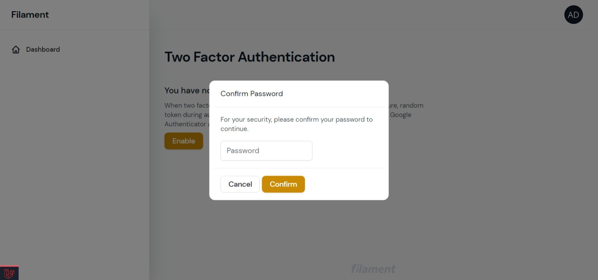
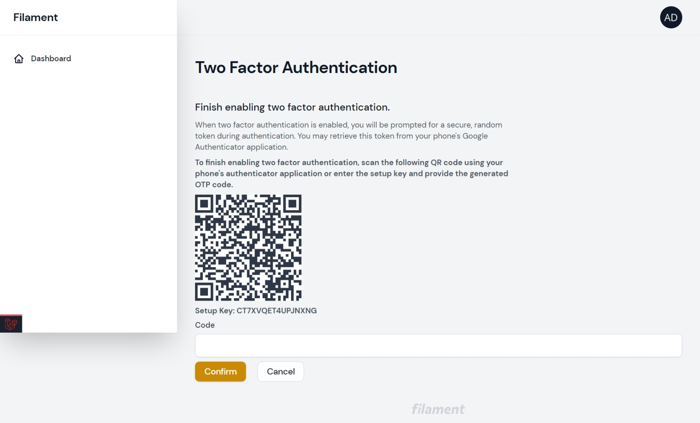
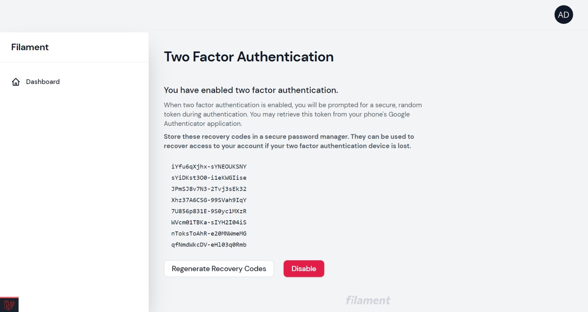
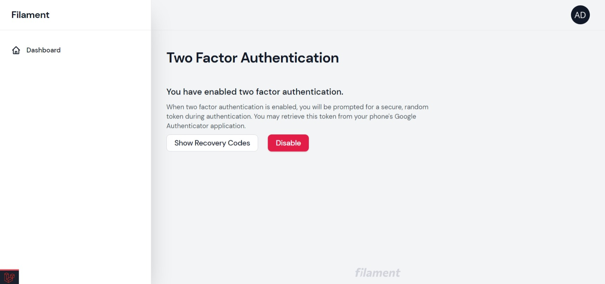
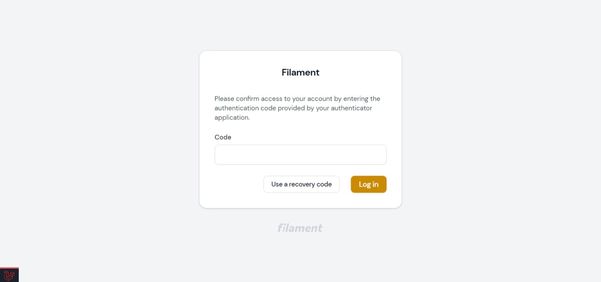
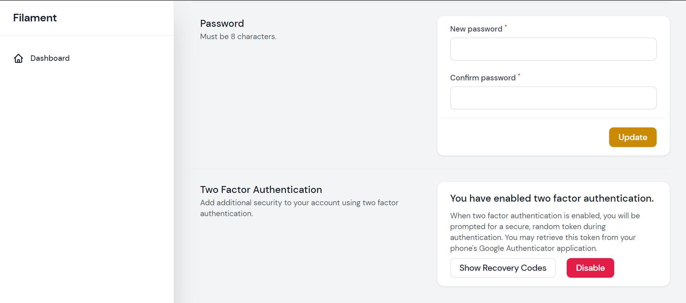

# Filament 2FA Plugin

A Two Factor Authentication plugin for Filament

## Installation

1. Install the package via composer (requires filament >= 2.10.40)
```bash
composer require webbingbrasil/filament-2fa
```

2. Publish assets and run migrations

```bash
php artisan vendor:publish --tag="filament-2fa-migrations"
php artisan migrate
```

Optionally, you can publish config or views:

```bash
php artisan vendor:publish --tag="filament-2fa-config"
php artisan vendor:publish --tag="filament-2fa-views"
```

3. Add `\Webbingbrasil\FilamentTwoFactor\TwoFactorAuthenticatable` trait to your user model.

4. Update the `config/filament.php` to point to the Two Factor Login::class.

```php
"auth" => [
    "guard" => env("FILAMENT_AUTH_GUARD", "web"),
    "pages" => [
        "login" =>
            \Webbingbrasil\FilamentTwoFactor\Http\Livewire\Auth\Login::class,
    ],
],
```

## Integrate With Custom Profile Page

This package has a component for two-factor setup that can be easily added to a profile page, like the one for [filament-jetstream-theme](https://github.com/webbingbrasil/filament-jetstream-theme).

Create a view with the `<livewire:filament-two-factor-form>` component like the example below:

```php
// resources/views/partials/2fa-section.blade.php
<hr />

<x-filament-jetstream::grid-section class="mt-8">
    <x-slot name="title">
        {{ __('filament-2fa::two-factor.title') }}
    </x-slot>

    <x-slot name="description">
        {{ __('filament-2fa::two-factor.description') }}
    </x-slot>

    <div class="space-y-3">
        <x-filament::card>
            <livewire:filament-two-factor-form>
        </x-filament::card>
    </div>
</x-filament-jetstream::grid-section>
```

Then add the view to your profile page using render hook:

```php
## in Service Provider file
public function boot()
{
    Filament::registerRenderHook(
        'filament-jetstream.profile-page.end',
        fn (): View => view('partials.2fa-section'),
    );
}
```

## Screenshots









## Credits

-   [Danilo Andrade](https://github.com/dmandrade)

## License

The MIT License (MIT). Please see [License File](LICENSE.md) for more information.
